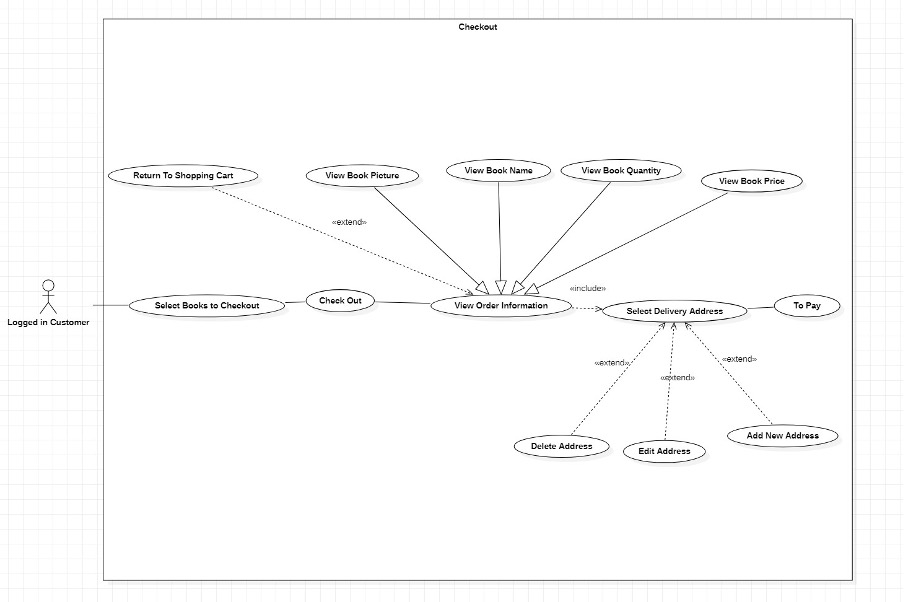

# 📚 E-Shop: Electronic Shopping Mall System

## Overview
E-Shop is an online shopping platform for purchasing programming-related books. Developed with **Java EE**, it features a structured **front-end** and **back-end** system, allowing users to browse, purchase, and manage book orders efficiently. Admins have additional privileges for website maintenance and database management.

## 🔧 Tech Stack
- **Front-End:** HTML, CSS, JavaScript, jQuery, Ajax  
- **Back-End:** Java EE, JSP, Servlet  
- **Database:** MySQL 8.0  
- **Server:** Tomcat v9.0.56  
- **Development Tools:** Eclipse  
- **Packages Used:** `jstl-1.2.jar`, `smartupload.jar`, `mysql-connector-java-8.0.27.jar`

## 🎯 Features

### 🔹 User Functionalities (Customers)
- **Register/Login/Logout**
- **Browse books** by category
- **Add to cart** and modify items
- **Purchase books** and view order history
- **Modify shipping address**

### 🔹 Admin Functionalities
- **Manage customers** (view/update details)
- **Modify product categories** and book details
- **Monitor orders** and website operations

### 🔹 Security & Enhancements
- **AJAX Implementation:** Prevents duplicate user registration & cart overloading  
- **Access Control:** Restricts user operations with filters  
- **Role-Based Access:** Only admins can access backend functionalities  
- **User Privacy Protection:** Customers can only see their own personal information  

## 🏗 Project Structure
- **MVC Pattern** for maintainability & scalability  
- **Responsive UI** similar to popular shopping platforms (e.g., Amazon)  
- **Advanced search & structured categories** for easy navigation  

## 🚀 Getting Started

### Prerequisites
- Install **Eclipse** IDE
- Setup **Tomcat v9.0.56** server
- Install **MySQL 8.0**
- Configure database connection in `mysql-connector-java-8.0.27.jar`

### Installation
1. Clone this repository:
   ```bash
   git clone https://github.com/yourusername/e-shop.git
   ```
## Project Design
### Project Architecture


### Database Relation Diagram


### MVC Pattern


### MVC Package Structure


### Use Case Diagrams and Sequence Diagrams for Clients
#### User Login


#### Personal Center


#### Order Management


#### Checkout



#### Cart Management


#### Book Display


### Use Case Diagrams for Admin
#### User Management


#### Book Management


#### Category Management


## 🎨 User Interface (UI) Screenshots

### 🔹 Authentication & User Management
#### User Login


#### User Registration


#### Reset Password


#### User Management (Admin)


---

### 🔹 Admin Panel
#### Admin Login


#### Admin Menu


#### Product Management


#### Category Management


---

### 🔹 Shopping & Orders
#### Product List


#### Product Detail


#### Search Product


#### Shopping Cart


#### Payment


#### Order Management


#### Paid Orders


#### Order Confirmation


#### Manage Address


